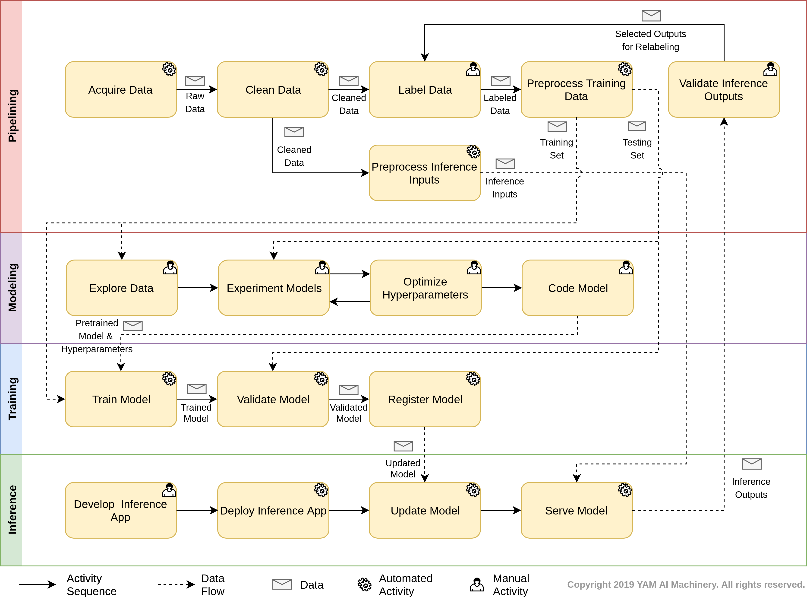

*******
YamFlow
*******

.. toctree::
   :maxdepth: 2
   :caption: Contents
   :hidden:

   pipelining.rst
   modeling.rst
   training.rst
   inference.rst

This specification is maintained at a `GitHub project <https://github.com/yam-ai/yamflow-doc>`_. 
Please leave your feedback on `GitHub Issues <https://github.com/yam-ai/yamflow-doc/issues>`_.

Introduction
============

YamFlow proposes a reference workflow for 
the machine learning (ML) development lifecyle.
This reference workflow is aimed to provide a canonical taxonomy for 
practitioners to understand and communicate the activity sequences and the data flows 
typically involved in a ML process. In addition, YamFlow also serves
as the baseline for `YAM AI Machinery <https://www.yam.ai>`_ to design ML 
programming frameworks for developing interoperable and composable ML tasks.

YamFlow Overview
================

:numref:`yamflowchart` shows the flowchart of YamFlow, which specifies
the overall process of a typical ML implementation in the design time and run time. 
Although the actual processes of different ML implementations may vary, 
the activity sequences and data flows should largely resemble YamFlow.

.. _yamflowchart:

   
   YamFlow Chart.

YamFlow consists of the following work streams:

- :doc:`pipelining` specifies the work stream for building the data pipelines
  for ML modeling, training, and inference in the development time.
- :doc:`modeling` specifies the work stream for exploring the data, and 
  design and code the ML model in the design time.
- :doc:`training` specifies the work stream for training the coded model in the 
  recurrent training time.
- :doc:`inference` specifies the work stream for deploying the inference 
  application and serve the trained model in the runtime.

