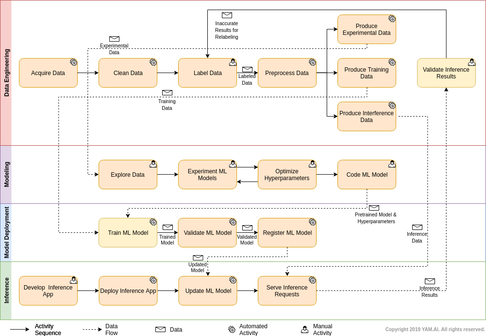

.. YamFlow Documentation documentation master file, created by
   sphinx-quickstart on Thu Jan 24 14:21:28 2019.
   You can adapt this file completely to your liking, but it should at least
   contain the root `toctree` directive.

*********************
YamFlow Documentation
*********************

.. toctree::
   :maxdepth: 2
   :caption: Contents:

Introduction
============

YamFlow proposes a reference workflow for machine learning (ML).
This reference workflow is aimed to provide a canonical taxonomy for 
practitioners to understand and communicate the activity and data flows
typically involved in a ML process. In addition, YamFlow also serves
as the baseline for `YAM.AI <https://www.yam.ai>`_ to architect a 
programming framework for coding interoperable and composable ML tasks.

YamFlow Overview
================

   
   YamFlow Chart.

