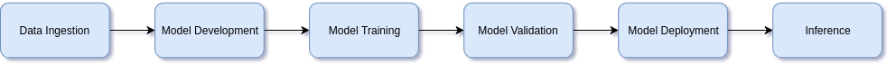

.. YamFlow Documentation documentation master file, created by
   sphinx-quickstart on Thu Jan 24 14:21:28 2019.
   You can adapt this file completely to your liking, but it should at least
   contain the root `toctree` directive.

*********************
YamFlow Documentation
*********************

.. toctree::
   :maxdepth: 2
   :caption: Contents:

YamFlow proposes a standard machine learning (ML) workflow of various 
activities, such as training, model validation, model deployment, 
and inference. 
With standardizing ML workflows, these activities can be automated
so as to so as to mash up and automate ML pipelines.

Core ML Activities
==================

   
   ML core activities.

The above figure shows the core ML activities.

